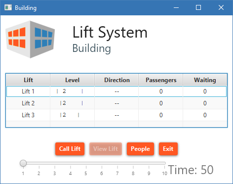
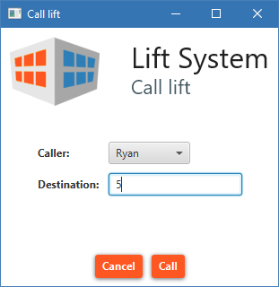
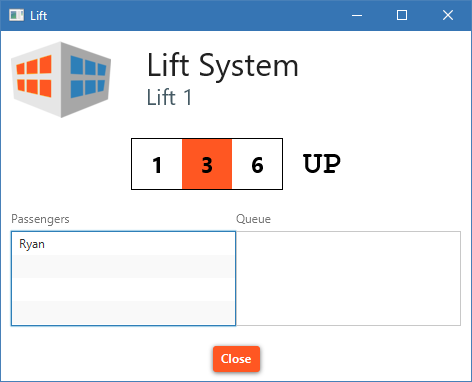

# Lift System

JavaFX application of Lift System created for **48024 Applications Programming** course at UTS.

It implements basic object-oriented design, GUI and MVC. Written in Java and FXML languages.

## Preview

  

  

  

  

